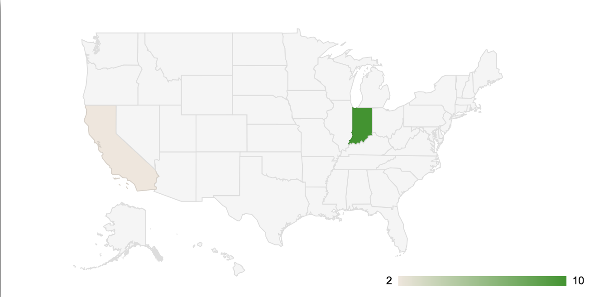

# Geo Charts



```text
  viz.chart({
    sql: "SELECT * FROM Geo",
    chartType: "GeoChart",
    containerId: "chart1",
    options: {
      region: 'US',
      displayMode: 'regions',
      resolution: 'provinces',
    }
  });
```

