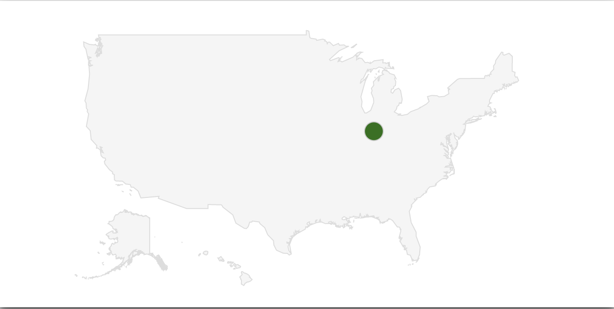

# Geo Charts \(Markers\)



```text
viz.chart({
    sql: "SELECT Lat, Long, Name FROM Locations",
    chartType: "GeoChart",
    containerId: "chart1",
    options: {
      region: 'US'
    }
  });
```

