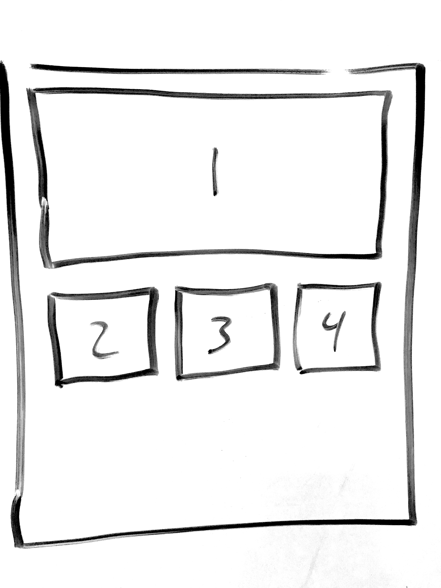

# Custom Grid 1



To create a grid layout like the sketch above, adjust your HTML and CSS like the following examples. But be careful not to simply copy and paste everything here.

### HTML

Notice that the "card" for the first chart also has a class called "full-width". We will use this class to make a chart span the full width of the page, while the others will fall into a grid with 3 charts per row.

```markup
	<div id='page'>
    	<div class="card full-width">
			<div id="chart1"></div>
		</div>
		<div class="card">
			<div id="chart2"></div>
		</div>
		<div class="card">
			<div id="chart3"></div>
		</div>
		<div class="card">
			<div id="chart4"></div>
		</div>
	</div>
```

### CSS

First, notice the _id="page" \(\#page\)_ style defines the normal grid design of 3 elements \(or 3 columns\) per row. `grid-template-columns: 1fr 1fr 1fr;` This applies to all the grid elements inside the _id = "page"_ element.

Next, any element with the class _"full-width"_  will start at the first position and span 3 columns. `grid-column: 1 / span 3;`

We can also add a style \(look for @media ... below \) that makes our dashboard mobile-friendly where all the charts just stack on top of each other if the screen is less than 700px wide. 

```css
#page {
  display: grid;
  grid-template-columns: 1fr 1fr 1fr;
  grid-gap: 15px;
}

.full-width {
  grid-column: 1 / span 3;
}

@media only screen and (max-width: 700px) {
  .card {
    grid-column: 1 / span 3;
  }
}
```

