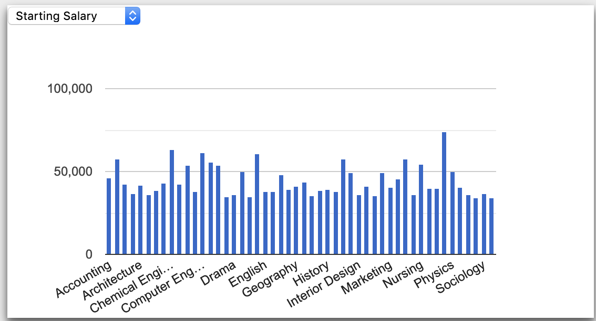

# Selectable Chart Data



This example demonstrates how you can use a dropdown menu to allow a user to select, or filter, the data displayed on a column chart.


Uses[ jQuery Selectors](https://www.w3schools.com/jquery/jquery_ref_selectors.asp), the [jQuery val function](https://www.w3schools.com/jquERY/html_val.asp), and the[ jQuery change function](https://www.w3schools.com/jquery/event_change.asp).


### HTML

The `select` element will be used to filter the data for a column chart that will be inserted in the "chart2" `div`. 

```markup
<div class="card">
  <select id="salary-select">
    <option value="StartingMedianSalary" selected>Starting Salary</option>
    <option value="MidCareerMedianSalary">Mid-Career Salary</option>
  </select>
  <div id="chart2"></div>
</div>
```

### Javascript

Add the following code to the bottom of the `setup()` function. This will "listen" for changes to the dropdown selector and re-run the `composeCharts()` function when it is changed.

```javascript
$("#salary-select").change(function () {
    composeCharts();
  });
```

The following "viz.chart" function defines a column chart that will use the value selected by the user in the SQL to retrieve the right column of data to chart.

```javascript
viz.chart({
    sql: `SELECT Major, ${$("#salary-select").val()} FROM Degrees`,
    chartType: "ColumnChart",
    containerId: "chart2"
});
```

