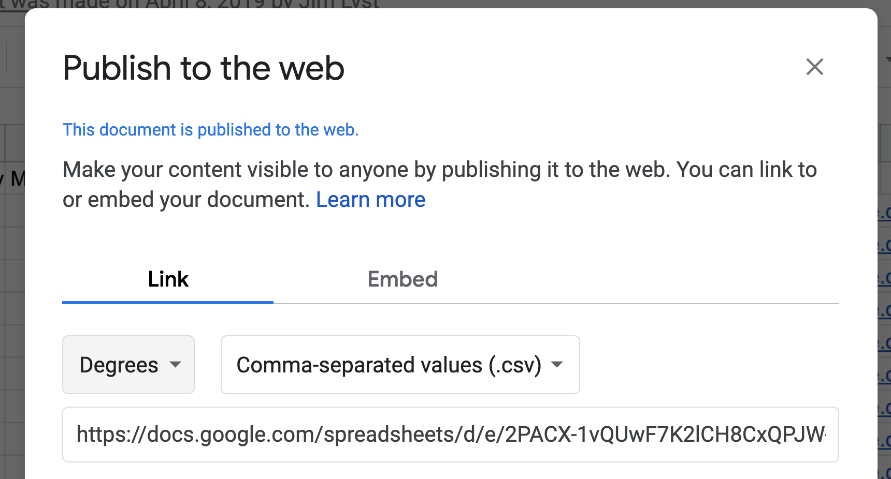

# 4 - Creating Your Own Database \(Google Sheet\)




For reference, when you want to find real-world data, consider using this resource.

[https://www.freecodecamp.org/news/https-medium-freecodecamp-org-best-free-open-data-sources-anyone-can-use-a65b514b0f2d/](https://www.freecodecamp.org/news/https-medium-freecodecamp-org-best-free-open-data-sources-anyone-can-use-a65b514b0f2d/)


### 1 - Create a Google Sheets File and Add Data

Create a Google Sheet file then create a simple table, like below, that could be used for a Scatter Chart. Also, name your individual sheet \(the tab at the bottom\) something like "myData".

| x | y |
| :--- | :--- |
| 3 | 4 |
| 4 | 6 |

### 2 - Publish Your Google Sheets File

Create a Google Sheets file and publish it by selection `file`&gt;`Publish to the web...` then click the _Publish_ button. 

### 3 - Get the Public Link for a Table

Next click select the _tab name_ you want to access and choose _Comma-separated values \(.csv\)._ Then **copy the link provided**. See the image below for an example the selects a "Degrees" tab and Comma-separated values..   
__ 

### 4 - Load Your Table in Javascript

Copy the code below and paste it just after this line. Now replace the link with your table link copied in the previous step and change the tab label \(e.g. 'myData'\) to match your sheet tab label. You can change the `composeMyCharts` function name as you wish or keep it the same.

```javascript
viz.loadTable('https://docs.google.com/spreadsheets/d/e/2PACX-1vQUwF7K2lCH8CxQPJW-X7NqENwuwUM4eAeNUKw3j6yppO0tipC6yUB2hQPtRBZf19mmVbM5TdkkengZ/pub?gid=1030028695&single=true&output=csv', 'myData')
    .then(composeMyCharts);
```

Now you can access your database in your SQL statements. Remember that your individual sheet names are the tables you can select from in SQL. So if you want to get all the columns from a sheet \(table\) called "myData", then you would use the following:`SELECT * FROM myData`

### 5 - Create Charts from Your New Table

Create a function in your Javascript that will then define the charts for your new table. You can use the example below as a template, but you want the ensure the function name used in step 3 \(e.g. composeMyCharts\) matches this function name. You will also want to change the SQL and ensure that you have HTML elements with ID's to display the charts.

```javascript
function composeMyCharts() {
  viz.chart({
    sql:"SELECT x, y FROM myData",
    chartType:"ScatterChart",
    containerId:"chart1"
  });

  viz.chart({
    sql:"SELECT * FROM myData",
    chartType:"Table",
    containerId:"chart2"
  });
}
```


For any additional tables \(Spreadsheet Tabs\) you want to incorporate, you will repeat steps 2 through 5 above with the appropriate link, tab name, and additional function for composing charts.


